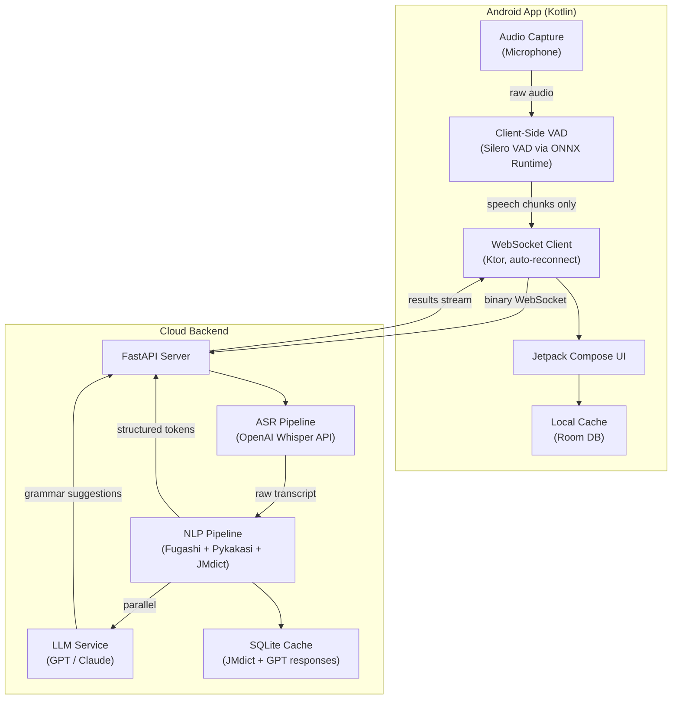
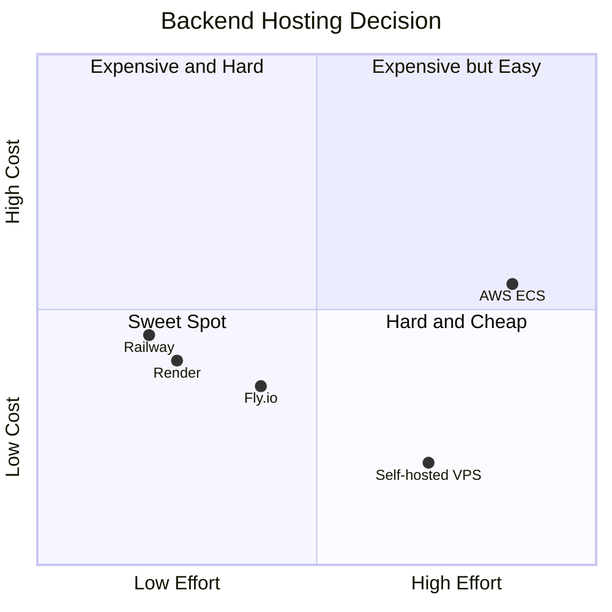
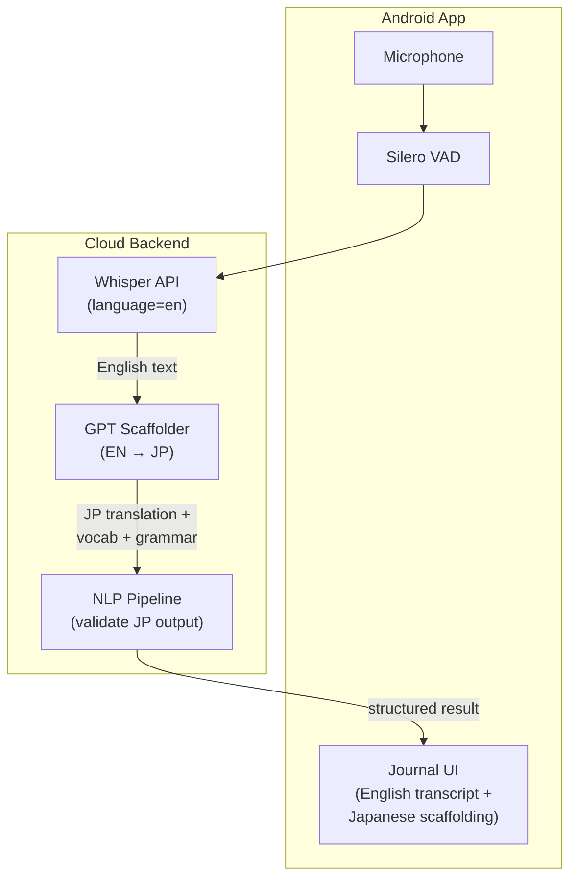
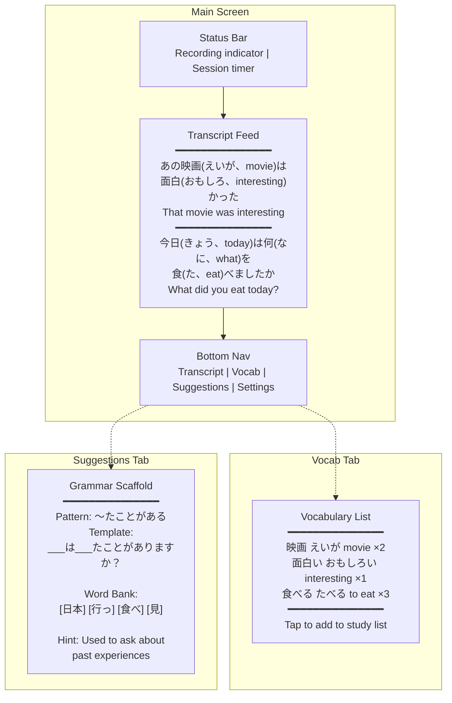

# KotoFloat Android Revamp Plan

**App name:** KotoFloat — 言葉 (kotoba, "words") + float (overlay). A Japanese language learning companion that floats alongside your conversations.
**Date:** 2026-03-30
**Status:** PHASE 1 IMPLEMENTED
**Scope:** Full platform migration from Tauri desktop + home server to Android app + cloud-hosted backend

---

## 1. Problem Statement

KotoFloat currently runs as a Tauri (Svelte) desktop app with a Python FastAPI backend on a home server, designed for Discord voice call overlay. This setup:
- Requires the home server (NucBox) to be always-on and reachable
- Only works on desktop (macOS)
- Requires BlackHole virtual audio routing
- Tied to Discord -- can't be used in real-life face-to-face conversations

**Goal:** Rebuild as an Android app (Kotlin) with a cloud-hosted backend for **real-life, face-to-face Japanese conversations** and **English-to-Japanese journal scaffolding**. Two modes:

1. **Conversation mode:** Phone sits on table, listens to Japanese conversation via microphone, provides real-time transcription + vocabulary + grammar suggestions.
2. **Journal mode:** You speak in English about your day. The app transcribes your English and scaffolds the Japanese translation — vocabulary, grammar patterns, sentence structure — helping you build toward expressing the same thoughts in Japanese.

No longer tied to Discord or any specific communication platform.

---

## 2. Architecture Overview



---

## 3. Component Breakdown

### 3.1 Android App (Kotlin + Jetpack Compose)

**Audio Capture:**

Simple **microphone capture** -- the phone sits on the table during a face-to-face Japanese conversation and picks up both speakers. No app audio routing, no MediaProjection, no virtual audio devices.

**Phase 0 PoC requirement:** Before any architecture work, build a prototype Android app that:
1. Captures microphone audio at 16kHz mono
2. Streams a 3-second chunk to OpenAI Whisper API
3. Verifies Japanese transcription quality from in-person conversation audio

If mic quality is insufficient in noisy environments, explore: (a) external/clip-on microphone, (b) directional mic mode if supported by device. Only proceed to full implementation after PoC validates acceptable ASR accuracy.

**Client-Side VAD:**
- Use **Silero VAD** with TFLite runtime (proven Android implementation, ~1.5MB model, actively maintained)
- NOT WebRTC VAD via JNI -- WebRTC's VAD is not available as a simple Android dependency and would require pulling libwebrtc or finding an unmaintained JNI wrapper
- Silero VAD has official Android examples and runs efficiently on-device
- **Japanese accuracy caveat:** Silero was trained primarily on English/European languages. Japanese has different phoneme distribution. Phase 0 PoC must validate VAD segmentation quality on Japanese audio (measure missed utterances and false activations).
- **Model source:** Use official Silero ONNX model from `snakers4/silero-vad` repo + **ONNX Runtime for Android** (`com.microsoft.onnxruntime:onnxruntime-android`). NOT community TFLite conversions (unofficial, stale, no versioning). ONNX is the format Silero officially distributes and maintains. Bundle the model in APK `assets/` directory. Pin to a specific model version tag.
- **VAD framing loop** (core architectural component):
  1. `AudioRecord` produces `PCM_16BIT` (`ShortArray`) -- read size varies (typically 1024-4096+ bytes from `getMinBufferSize()`)
  2. **Convert to float32:** `ShortArray → FloatArray / 32768f` (normalize to [-1.0, 1.0] range -- Silero expects float32 input)
  3. **Enqueue into channel.** `AudioRecord.read()` returns variable-length chunks (not guaranteed 512 samples). **Producer maintains an internal carry buffer** (FloatArray accumulator + write index) spanning multiple reads: remainder samples from a read (e.g., 288 leftover from an 800-sample read) are carried to the next read cycle, not discarded. Only complete 512-sample windows are emitted to the Channel. Use a **Kotlin `Channel<AudioFrame>` with `capacity=64` and `BufferOverflow.DROP_OLDEST`** (~2s at 512 samples/window) as the thread-safe bridge between producer (Dispatchers.IO) and consumer (Dispatchers.Default). NOT a plain ArrayDeque or ShortArray with pointers -- those are not thread-safe across dispatchers and will cause silent data corruption. Normalizing in the producer ensures the ~2s capacity math is accurate and `DROP_OLDEST` drops one window at a time. **Known tradeoff:** on Channel overflow (DROP_OLDEST), the consumer misses frames, causing h/c state desync with the actual audio timeline. **Overflow detection:** producer stamps each FloatArray item with a monotonically incrementing sequence number (via a wrapper data class: `data class AudioFrame(val seq: Long, val samples: FloatArray)`). Consumer checks for seq gaps -- if a gap is detected, reset h/c to zeros to prevent sustained VAD drift. Kotlin Channel has no overflow callback, so producer-side stamping is the only way to detect drops. **On WebSocket reconnect, reset all five stateful components:** (1) flush Channel, (2) zero h/c VAD state, (3) clear the speech accumulation buffer (in-progress frames past ONNX inference, waiting for silence transition), (4) clear the producer carry buffer, (5) clear the short chunk buffer (sub-0.4s utterances held pending a longer companion). Without resetting all five, stale pre-disconnect audio contaminates the first post-reconnect utterance.
  4. **Dequeue 512-sample windows** (32ms frames at 16kHz) from ring buffer -- Silero v4 requires exactly 512 samples per inference call
  5. Run ONNX inference on each 512-sample window. **Silero v4 is stateful:** model takes 4 inputs: `input` (float32[1,512] -- 2D: batch x samples, NOT 3D), `sr` (int64=16000), `h` (float32[2,1,64]), `c` (float32[2,1,64]). **Verify exact tensor shapes** against the model definition in `snakers4/silero-vad` before writing the inference call (`onnx.load` + inspect `model.graph.input`). Model outputs `hn`/`cn` alongside speech probability. **Thread `hn`/`cn` back as `h`/`c` for the next frame** -- without this, each frame is evaluated with reset state and segmentation is broken. **Reset `h`/`c` to zeros on:** session start, `end_session`, AND WebSocket reconnect (new audio stream after disconnect carries stale state that would produce false activations or missed onsets).
  6. Accumulate consecutive speech-flagged windows into utterance chunks
  7. On silence transition (after hangover): emit the accumulated chunk with 200ms tail padding
  8. Short chunks (<0.4s) are buffered and merged with next chunk
- **Threading model:** Two coroutines connected by a Kotlin Channel (thread-safe, coroutine-native):
  - **Producer** (on `Dispatchers.IO` or `newSingleThreadContext("AudioCapture")`): `AudioRecord.read()` loop → float32 conversion → enqueue into ring buffer. `AudioRecord.read()` is a **blocking** call that parks the thread -- must NOT run on `Dispatchers.Default` (CPU-bounded pool, would starve ONNX inference and Compose recomposition). Must not be blocked by ONNX inference -- ring buffer absorbs backpressure (drop-oldest on overflow).
  - **Consumer** (on `Dispatchers.Default`): Dequeue 512-sample frames → ONNX inference → speech accumulation → chunk emission → WebSocket send. This is CPU-bound work, correct for Default. Silero inference is ~1-3ms on modern SoCs so this keeps up in steady state.
  - NOT running ONNX inference on the AudioRecord read thread -- a spike would cause `AudioRecord.ERROR_OVERRUN` and silently drop frames.
- Only stream audio frames containing speech -- saves battery and bandwidth
- 16kHz mono PCM at ~32KB/s when speaking, 0 when silent
- Silence hangover: 320ms (matching current behavior)
- Chunk overlap: VAD accumulates speech frames and adds 200ms tail padding (matching current `listener.py` behavior) to prevent word clipping at utterance boundaries. The client sends complete, overlapped speech chunks -- the server does not need to manage overlap.
- **Short utterance handling:** Chunks shorter than 0.4s are NOT discarded. Instead, they are buffered and prepended to the next speech chunk. This prevents losing common Japanese backchannel responses ("はい", "うん", "そう", "ね") which are often sub-0.4s. Only if the buffer accumulates >3s of total silence after a short chunk (indicating end of conversation turn) does the buffered audio get sent as-is. Whisper may hallucinate on very short clips, but losing valid utterances is worse.

**Audio Capture Service:**
- Runs as a foreground service with persistent notification
- Handles screen lock gracefully: microphone capture continues even when screen is off
- Exponential backoff reconnection to backend on network loss
- **WebSocket keepalive:** Client sends ping every 30s to prevent Fly.io's ~60s idle timeout from killing the connection. Server echoes pong. Fly.io proxy config also set to extend idle timeout.

**Android SDK targets:**
- **Min SDK: 26** (Android 8.0 Oreo) -- ~95% device coverage
- **Target SDK: 34+** (Android 14) -- mandatory for Play Store compliance since Aug 2023, and required even for sideloaded APKs to behave correctly on modern devices
- **Android 14+ foreground service requirement:** Manifest must declare `foregroundServiceType="microphone"` and request `FOREGROUND_SERVICE_MICROPHONE` permission. Microphone-only -- no MediaProjection needed.
- **Required permissions (full list):**
  - `RECORD_AUDIO` -- dangerous permission, requires runtime request from user (Android 6+)
  - `FOREGROUND_SERVICE` -- normal, manifest-only
  - `FOREGROUND_SERVICE_MICROPHONE` -- normal, manifest-only (Android 14+)
  - `WAKE_LOCK` -- normal, manifest-only (for `PARTIAL_WAKE_LOCK` during recording)
  - `INTERNET` -- normal, manifest-only
  - ~~`FOREGROUND_SERVICE_MEDIA_PROJECTION`~~ -- **removed post-pivot.** No longer needed since the app is for face-to-face conversations via microphone only.

**UI Screens:**

1. **Main Screen (Transcript View)**
   - Scrollable transcript feed (newest at bottom, auto-scroll)
   - Each entry: annotated Japanese text + English translation below
   - Tappable words: tap a kanji/word to see reading + meaning in a bottom sheet
   - Floating mic indicator (recording status + ambient audio level visualization)

2. **Vocabulary Panel (Bottom Sheet or Tab)**
   - List of extracted vocabulary from current session
   - Each item: word | reading | meaning | frequency count
   - Swipe to add to personal study list
   - Export to CSV

3. **Grammar Suggestions Panel (Slide-up or Tab)**
   - After each transcribed utterance (from either speaker -- no diarization in v1), shows:
     - Key grammar pattern identified (e.g., "~てもいいですか")
     - Fill-in-the-blank template: "___は ___てもいいですか？"
     - Word bank: suggested vocabulary (free-form, not mapped to specific blank positions)
     - Tap words to insert at cursor position in template -- user chooses which word fills which blank
   - Not a full sentence generator -- a scaffold for the user to construct their own reply
   - **No diarization caveat:** Without speaker identification, suggestions may scaffold a response to the user's own message. This is acceptable for v1 -- the user simply ignores irrelevant suggestions.
   - **Suggestion retention in fast conversations:** Suggestions do NOT auto-replace on every utterance. Instead: new suggestions queue up, and the current suggestion stays visible until the user swipes to dismiss or taps "next." A badge shows the count of pending suggestions. This prevents the panel from being unusable in rapid back-and-forth exchanges.

4. **Settings Screen**
   - Backend URL configuration (for self-hosting flexibility)
   - Language level preference (N5-N1) to filter suggestion complexity
   - Audio source selection (default mic, or external mic if connected)
   - Theme (dark/light)

**Authentication model:** The backend holds the OpenAI API key (single-user personal project). The Android app authenticates to the backend with a simple pre-shared API key (passed as `Authorization: Bearer <key>` on WebSocket upgrade). This keeps the OpenAI key off the device and lets the backend enforce rate limits. If you self-host, you set both keys in the backend `.env`.

**First-run flow:** On first launch with no API key configured, the app shows a setup screen requiring: (1) backend URL, (2) pre-shared API key. The main UI is not accessible until these are configured and a test connection to the backend `/api/health` endpoint succeeds. This is the security boundary -- the app is non-functional without valid credentials.

**Network security:** Android 9+ blocks cleartext HTTP by default. `network_security_config.xml` is a static compile-time resource -- it does NOT support CIDR ranges, only exact hostnames/IPs. For a personal sideloaded app, use `<base-config cleartextTrafficPermitted="true">` to permit cleartext globally. This is acceptable because: (1) it's a personal app, not distributed on the Play Store, (2) the only sensitive data is the pre-shared API key which is sent once on WebSocket upgrade, (3) the Fly.io production backend uses HTTPS/WSS anyway. The settings screen notes that HTTPS is recommended for non-LAN deployments.

**Local Storage (Room DB):**
- Session history (transcripts, vocab lists)
- Personal vocabulary study list
- Dictionary lookup cache (tokens received from backend, keyed by surface form -- avoids re-rendering for repeated words)
- User preferences

**Tech Stack:**
- Kotlin, min SDK 26 (Android 8.0+)
- Jetpack Compose (UI)
- Hilt (dependency injection)
- Room (local database)
- **Ktor** WebSocket client (modern, Kotlin-native, actively maintained -- Scarlet is unmaintained since 2022 with OkHttp 4.x compatibility issues)
- Silero VAD via **ONNX Runtime for Android** (`com.microsoft.onnxruntime:onnxruntime-android`) + official Silero ONNX model from `snakers4/silero-vad`. Avoids TFLite/LiteRT dependency entirely -- ONNX is the format Silero officially maintains. **Pin both versions together** in `build.gradle.kts` -- ONNX Runtime has opset-version breaking changes across minor versions; an unpinned runtime + pinned model produces garbage VAD output with no crash.
- **APK size note:** ONNX Runtime adds ~15-25MB per ABI. Use ABI splits (`arm64-v8a` only for modern devices) to keep APK size reasonable (~30-40MB total). If sideloading UX is a concern, can also use AAB with per-device splits, but for sideloading a single `arm64-v8a` APK is fine.
- AudioRecord API (microphone capture)
- Coroutines + Flow (async/streaming)

### 3.2 Cloud Backend (Python FastAPI)

Port the existing FastAPI backend with these changes:

**Keep:**
- ASR pipeline (OpenAI Whisper API)
- NLP pipeline (Fugashi + Pykakasi + Jisho lookups)
- GPT formatting (annotation polish + translation)
- SQLite caching layer (Jisho, GPT responses)

**Change:**
- Replace file-based IPC (`transcript.txt`, `waveform.json`, `suggestions.json`) with WebSocket streaming
- Replace `sounddevice` local audio capture with receiving audio chunks over WebSocket
- Add WebSocket endpoint: `ws://host/ws/session` for bidirectional streaming
- Add authentication (API key or JWT) to prevent abuse
- Add rate limiting per client

**Add:**
- Grammar suggestion endpoint powered by LLM (runs parallel with annotation)
- Session management (session context in-memory, keyed by session_id)
- Health/status endpoint (`GET /api/health`) for the Android app to check connectivity
- Pre-shared API key auth on WebSocket upgrade (`Authorization: Bearer <key>`)
- Keepalive handler: respond to client pings within the 30s heartbeat cycle
- Session state persisted to backend SQLite (not just in-memory) -- survives VM restarts, deploys, and OOM events. **Write cadence:** session state (vocabulary list, conversation history) is written to SQLite **after each completed transcript event** (not just on end_session). This ensures the persistence claim holds even on OOM kills mid-session.
- `end_session` handler: client sends `{ "type": "end_session" }` on stop; server flushes final session state and cancels pending LLM calls

**WebSocket Protocol:**

Uses **binary frames** for audio (no base64 overhead) and **text frames** for JSON control messages.

```
Client -> Server:
  [binary frame]: raw 16kHz mono PCM bytes (speech chunks only, post-VAD, short chunks buffered and merged)
  [text frame]: { "type": "start_session", "session_id": "uuid", "config": {
    "jlpt_level": "N3",
    "audio_format": {"sample_rate": 16000, "channels": 1, "encoding": "pcm_s16le"}
  }}
  [binary frame]: (flush) any remaining buffered audio before end_session
  [text frame]: { "type": "end_session", "session_id": "uuid" }
  [text frame]: { "type": "ping" }

Server -> Client:
  [text frame]: { "type": "transcript", "session_id": "uuid", "seq": 1,  // monotonically incrementing per session, for display ordering only
    "tokens": [
      {"surface": "映画", "reading": "えいが", "meaning": "movie", "pos": "noun"},
      {"surface": "は", "reading": null, "meaning": null, "pos": "particle"}
    ],
    "translation": "That movie was interesting" }
  [text frame]: { "type": "vocabulary", "session_id": "uuid", "mode": "snapshot|delta",
    "items": [{"ja": "映画", "reading": "えいが", "en": "movie", "count": 2}] }
  [text frame]: { "type": "suggestion", "session_id": "uuid",
    "pattern": "~てもいい", "template": "___は___てもいいですか",
    "words": [{"ja": "何", "reading": "なに"}, {"ja": "食べ", "reading": "たべ"}],
    "hint": "Asking for permission" }
  [text frame]: { "type": "error", "code": "rate_limit", "message": "..." }
  [text frame]: { "type": "error", "code": "no_session", "message": "..." }  // binary frame received before start_session
  [text frame]: { "type": "pong" }
```

**Key protocol decisions:**
- Binary frames for audio (saves ~33% bandwidth vs base64)
- Structured token data instead of HTML (Android renders natively via Compose)
- Session ID on every message (supports reconnection and future multi-client)
- Error message type for surfacing backend failures to client
- **Keepalive:** Client sends `ping` every 30s. Server responds with `pong`. If no pong received within 10s, client triggers reconnection.
- **Short chunk buffering:** Client-side VAD buffers speech chunks shorter than 0.4s and prepends them to the next chunk. If 3s of silence follows a short chunk (end of turn), the buffer is sent as-is. This preserves common backchannel responses ("はい", "うん") while minimizing Whisper hallucination risk on tiny clips.
- **Client buffer flush on stop:** Before sending `end_session`, the client must drain any buffered short chunks (send remaining audio). This prevents dropping the user's last utterance.
- **Audio format validation:** `start_session` includes `audio_format` config. Server validates on first binary frame. On mismatch: returns `{"type": "error", "code": "audio_format_mismatch"}` and **closes the WebSocket connection**. Client must reconnect with correct format. (Holding the connection open would let a buggy client flood the server with wrong-format frames.)
- **Reconnect cancellation:** On `start_session` with a `session_id` that has an active in-memory coroutine (including orphan state from a prior disconnect), **cancel the orphan coroutine with `cancelAndJoin()` before starting the new handler**. Otherwise the orphan can complete a Whisper call and write stale state to SQLite after the new handler has already read its starting state -- causing seq duplication and vocabulary corruption. **Cancellation safety (Python asyncio):** the orphan's SQLite persist must complete even under cancellation. **Important:** `asyncio.shield()` + `gather()` does NOT guarantee the shielded coroutine finishes before `gather` returns -- the shielded persist detaches and runs as an orphaned task. Correct pattern:
```python
persist_future = asyncio.ensure_future(persist(session_state))
orphan_task.cancel()
await asyncio.gather(orphan_task, return_exceptions=True)
await persist_future  # explicitly wait for persist to finish
```
The new handler must await the persist future **before** reading SQLite as authoritative state. Without the explicit `await persist_future`, the new handler races against a still-writing orphan persist.
- **Session lifecycle:** `start_session` initializes or resumes. `end_session` triggers a **graceful drain**: the server completes any in-flight Whisper transcription (to avoid dropping the user's last utterance from the flush frame), but cancels pending annotation/grammar LLM calls only. **Task tracking:** the session handler maintains a set of all Whisper tasks from the moment `asyncio.create_task()` is called (not from when they start running). The drain waits for all tracked Whisper tasks, including ones created but not yet scheduled (e.g., from the flush frame that just arrived). Session state is flushed to SQLite after the final transcript completes. Abrupt disconnects time out after **90s** of no pings, then auto-cleanup (cancel ALL pending calls including Whisper, persist session state to SQLite). **Important:** if a Whisper call completes between disconnect and the 90s trigger, the session coroutine will try to send over a dead WebSocket and throw. All WebSocket sends in the session handler must be wrapped in try/except that falls through to the SQLite persist step regardless -- otherwise the coroutine crashes before persisting.
- **Per-LLM-call timeout:** Each individual LLM call (annotation or grammar suggestion) has a **10s timeout**. If the call exceeds this, the task is cancelled and the server sends the available result without it (e.g., transcript without annotation polish, or transcript without grammar suggestion). This is separate from the 90s session orphan timeout.
- **`seq` field:** Monotonically incrementing integer per session, starting at 1. Used by the client for display ordering only. No gap detection or replay semantics -- if a `seq` is missed (e.g., due to disconnect), the client simply doesn't have that transcript entry. **On session resume:** `last_seq` is persisted to backend SQLite alongside session state. Resumed sessions continue from the last persisted value (not restart at 1) to prevent duplicate seq values in the client's Room DB.
- **Binary frame before `start_session`:** If the server receives a binary (audio) frame on a connection with no active session, it returns `{"type": "error", "code": "no_session"}` and discards the frame. Client must send `start_session` first.
- **Vocabulary message semantics:** First `vocabulary` message after `start_session` (including resume) is a **full snapshot** (`mode: "snapshot"`) -- client replaces its local vocabulary list. Subsequent messages are **deltas** (`mode: "delta"`) -- client appends/updates items. This prevents client/server divergence after reconnect.
- **Session resumption on reconnect:** When the client reconnects with the same `session_id`, the server restores session context from SQLite (accumulated vocabulary list, JLPT level, conversation history for grammar suggestions). Survives server restarts/deploys. **No message replay** -- transcripts missed during disconnect are lost. The client's local Room DB has whatever was received before disconnect.

### 3.3 Grammar Suggestion Engine (New Feature)

**How it works:**
1. After each transcribed utterance, send context (last 3-5 utterances) to LLM
2. LLM identifies the grammar pattern being used and the topic
3. LLM generates a fill-in-the-blank response template appropriate to the conversation
4. LLM provides a word bank of suggested vocabulary
5. Results streamed back to the app

**LLM Prompt Design:**
Use OpenAI's **structured output** (`response_format={"type": "json_schema", "json_schema": ...}`) to guarantee response shape. The LLM will intermittently return markdown or prose without enforced JSON.

```
System: You are a Japanese conversation assistant for a learner at {jlpt_level} level.

User: Given this conversation context:
{last 5 utterances}

Generate a response scaffold (NOT a complete sentence) that helps the learner form their own reply.

Response format (enforced via JSON schema -- all fields required):
{
  "pattern": "~てもいいですか",           // required string
  "template": "___は___てもいいですか？",  // required string
  "words": [{"ja": "何", "reading": "なに"}, {"ja": "食べ", "reading": "たべ"}],  // required array
  "hint": "Used to ask for permission"    // required string -- must be in the enforced schema
}
```

**JSON schema enforcement:** Define the response schema in the OpenAI API call. If using a model that doesn't support `json_schema`, fall back to `response_format={"type": "json_object"}` with the schema in the prompt. Parse with validation; on parse failure, discard the suggestion (don't crash).

**Important constraints:**
- Suggestions for both speakers for now (no speaker diarization). User ignores irrelevant suggestions.
- Keep suggestions at the user's configured JLPT level
- Rate-limit to avoid excessive API calls (one suggestion per utterance, debounced)
- **LLM context window:** Hard-capped at the last **5 utterances** (not the full session history). Enforced at prompt construction time by querying only the 5 most recent transcript entries. Prevents latency and cost growth on long sessions.
- **Suggestion queue cap:** Maximum **5 pending suggestions** in the client queue. When full, drop the oldest. Prevents absurd badge counts and memory leaks on long sessions.

**Latency budget for grammar suggestions:**
- Target: suggestion appears within 3s of utterance end
- Annotation LLM call and grammar suggestion LLM call run **in parallel** (not sequentially)
- Use a lightweight model (gpt-4.1-nano) for grammar suggestions to minimize latency
- If suggestion takes >5s, display annotation results first, suggestion streams in later

---

## 4. Hosting Plan

### Backend Hosting Options



**Recommended: Railway or Fly.io**

| Platform | Free Tier | Paid | WebSocket Support | Python Support | Notes |
|----------|-----------|------|-------------------|----------------|-------|
| **Railway** | $5 free credit/mo | ~$5-20/mo | Yes | Yes (Docker) | Easiest deploy, good DX |
| **Fly.io** | 256MB free (insufficient) | ~$7-15/mo for 512MB-1GB | Yes (native) | Yes (Docker) | Best for WebSockets, global edge. **Paid plan required** for this workload. |
| **Render** | 750 hrs free | ~$7-25/mo | Yes | Yes (native) | Auto-sleep on free tier (cold starts) |

**Recommendation:** **Fly.io** -- best WebSocket support, low latency with edge deployment, reasonable pricing. Deploy as a Docker container. **Keep VM warm** (no scale-to-zero) to avoid 30-60s cold starts with the ~1GB image.

### Cost Estimate (Monthly)

| Item | Cost | Notes |
|------|------|-------|
| Fly.io hosting | ~$7-15/mo | 1 shared VM, **512MB-1GB RAM** (UniDic ~350MB runtime + Python + buffers). Includes ~$0.15/mo for 1GB persistent volume. |
| OpenAI ASR (gpt-4o-mini-transcribe) | ~$1-4/mo | **$0.003/min** (~5-20 hrs/mo). Half the cost of whisper-1 ($0.006/min). |
| OpenAI GPT (annotation, gpt-5-nano) | ~$0.50-2/mo | **$0.05/1M input, $0.40/1M output**. Cheapest capable model. |
| OpenAI GPT (grammar, gpt-5-nano) | ~$1-4/mo | One call per utterance, debounced |
| OpenAI GPT (journal scaffolding, gpt-5-nano) | ~$1.50-3/mo | Phase 4; ~2x tokens vs annotation due to EN→JP detail |
| **Total** | **~$11-28/mo** | Varies with usage intensity; journal mode adds ~$1.50-3 |

**Model selection rationale (as of 2026-03-30):**
- **ASR:** `gpt-4o-mini-transcribe` — $0.003/min, half the cost of `whisper-1` ($0.006/min). Pure cost win, no quality tradeoff.
- **LLM:** `gpt-5-nano` — $0.05/$0.40 per 1M tokens. Half the input cost of `gpt-4.1-nano` ($0.10/$0.40).
- **Not GPT-5 (full):** $1.25/$10.00 — mid-range, overkill for annotation/grammar tasks. The "GPT-5 is cheapest" claim refers to the nano/mini tiers, not the full model.

**Quality benchmarks (Artificial Analysis Intelligence Index, 2026-03-30):**

| Model | Intelligence | Rank | Speed (tok/s) | Input $/1M | Context |
|-------|-------------|------|---------------|------------|---------|
| **gpt-5-nano** | **27** | #14/170 | 148 | $0.05 | 400K |
| gpt-4.1-nano | 13 | #46/72 | 179 | $0.10 | 1M |
| gpt-4o-mini | 13 | #51/72 | 33 | $0.15 | 128K |

gpt-5-nano is **2x smarter and half the price** vs gpt-4.1-nano. However:

- **Latency risk:** gpt-5-nano is a reasoning model. At "high" reasoning effort, TTFT is 72s (vs 0.88s median). For our annotation/grammar tasks we'd use low/no reasoning effort, which should be much faster — but this is unverified.
- **Verbosity:** Generated 110M tokens in eval vs 8.3M average. May produce longer responses than needed for simple annotation. Monitor output token costs.
- **Fallback:** If latency is bad in practice, swap to `gpt-4.1-nano` via `OPENAI_MODEL` env var. Both are configured, no code change needed.
- **Context window:** 400K vs 1M — irrelevant for our short-utterance tasks (never exceeds a few hundred tokens).

**Note on dictionary:** Jisho.org is an undocumented public endpoint with no SLA and has broken before. The backend bundles a local **JMdict SQLite database** (~30MB) as the sole dictionary source. Jisho is dropped entirely -- JMdict covers all needed lookups (word meanings, readings, POS) and removing Jisho eliminates an unreliable code path.

---

## 5. Migration Strategy

### What Gets Reused
- `listener.py` core logic: VAD, chunking, overlap -- adapted to receive WebSocket audio instead of local device
- `gpt_vocab_analyzer.py`: vocabulary analysis pipeline
- NLP pipeline: Fugashi, Pykakasi integration (mostly unchanged; Jisho calls replaced with JMdict SQLite lookups)
- `server/main.py`: FastAPI structure, adapted endpoints
- SQLite caching patterns

### What Gets Replaced
- Tauri desktop app -> Android Kotlin app
- Svelte UI -> Jetpack Compose
- Local audio capture (sounddevice/BlackHole) -> Microphone capture on Android (face-to-face conversations)
- File-based IPC -> WebSocket streaming (binary frames for audio)
- Home server hosting -> Cloud (Fly.io)
- Jisho API dependency -> Bundled JMdict SQLite (Jisho dropped entirely)

### What's New
- WebSocket streaming protocol
- Android audio capture service
- Grammar suggestion engine
- Session management
- Authentication layer
- Mobile-optimized UI

---

## 6. Implementation Phases

### Phase 0: Audio Capture Prototype (GO/NO-GO GATE)
**This is a prototype, not throwaway code.** It becomes the seed of the Phase 2 foreground service. Build it with proper architecture (Kotlin coroutines, service lifecycle handling) but skip Hilt/Room/Compose -- those are added in Phase 2.
1. Build an Android app: microphone capture -> 16kHz mono PCM (as a foreground service with `foregroundServiceType="microphone"`)
2. Integrate Silero VAD (ONNX Runtime) to segment speech -- test both VAD-chunked output AND fixed 3s chunks
   - **Face-to-face scenario:** Phone on table between two speakers, ~0.5-1m from each person
3. Stream chunks to OpenAI Whisper API directly (no backend needed)
4. Test matrix (all face-to-face scenarios):
   - **Quiet room:** Phone on table, two speakers at normal volume (~0.5-1m away)
   - **Moderate noise:** Cafe/restaurant background noise, speakers at conversational volume
   - **One-sided:** Only one speaker is Japanese (the other person's speech should still be captured but may be in another language)
   - Short utterances (<1s) from VAD -- verify buffering behavior (chunks <0.4s are buffered and merged with next chunk, sent as-is after 3s silence)
   - Long utterances (>5s) from VAD -- verify chunking caps work
   - **VAD segmentation quality on Japanese:** measure missed utterances and false activations. If Silero VAD misses >15% of Japanese utterances, evaluate alternatives (e.g., energy-based VAD, or server-side VAD as fallback).
5. **Decision gate:** ASR accuracy must be acceptable on the **moderate noise test case** (cafe-level background noise), not just quiet room. Threshold: >80% character accuracy with VAD-chunked audio in the moderate noise scenario. Clear-speech-only accuracy is insufficient to validate the face-to-face use case. If moderate noise fails, evaluate: external mic, noise suppression preprocessing, or adjusting expectations for noisy venues.
6. Deliverable: PoC app + accuracy report with test matrix results (both ASR and VAD metrics)

### Phase 1: Backend Migration (Cloud-Ready)
1. Dockerize the existing Python backend
   - **Base image:** `python:3.12-slim-bookworm` (Debian). NOT Alpine -- Fugashi/Pykakasi have native C extensions (MeCab) that fail on musl libc.
   - Multi-stage build: build stage installs UniDic + compiles C extensions, runtime stage copies artifacts
   - Expected image size: **~800MB-1GB** (Python base ~150MB + UniDic ~350MB + Fugashi/deps ~200MB + JMdict ~30MB + app code)
   - Target VM: **512MB-1GB RAM** on Fly.io. Profile memory during this phase.
   - **Keep VM warm** (no scale-to-zero) -- cold starts with this image size would take 30-60s, unacceptable for real-time use
2. Replace file-based IPC with WebSocket endpoints (binary frames for audio, text frames for JSON)
3. Adapt `listener.py`: remove sounddevice, receive audio over WebSocket. Client handles VAD and overlap -- server receives ready-to-transcribe speech chunks. **Critical: wrap received raw PCM bytes in a WAV container** (prepend RIFF/fmt/data header with sample rate from `start_session` config) before calling OpenAI Whisper API. Whisper rejects raw PCM -- it requires a proper audio file container (WAV, MP3, etc.). The existing `listener.py` handles this via sounddevice's WAV output; this must be explicitly preserved during migration. **WAV header size fields** (`ChunkSize` at offset 4, `Subchunk2Size` at offset 40) must be computed from the actual chunk byte count, not templated from a fixed header.
4. Bundle JMdict SQLite for dictionary lookups (drop Jisho API entirely). **Build step:** Download pre-built `jmdict-eng-3.x.x.db` from `scriptin/jmdict-simplified` GitHub releases in the Dockerfile build stage. Pin to a specific release SHA for reproducibility. Store at `/app/static/jmdict.db` in the image (NOT on the persistent volume mount). ~30MB compressed.
5. Add pre-shared API key auth on WebSocket upgrade
6. Add session management (session_id, in-memory context, keepalive ping/pong handler)
7. Configure Fly.io:
   - Extend idle timeout in `fly.toml`
   - Set persistent VM: `min_machines_running = 1`, **`max_machines_running = 1`** (Fly.io persistent volumes are single-machine attachments; auto-scale up would spawn a second VM with no volume, silently running with ephemeral SQLite)
   - Set **`[deploy] strategy = "immediate"`** in `fly.toml`. Fly.io's default rolling deploy starts the new machine before stopping the old one, but a persistent volume can only attach to one machine at a time. Immediate strategy stops old first, then starts new -- a few seconds of downtime on deploy, acceptable for a personal tool.
   - **Create a persistent volume** (`fly volumes create kotofloat_data --size 1`) and mount at `/data` in `fly.toml`. **Writable** SQLite databases (session state, response caches) live on the persistent volume. **Static read-only** files (JMdict) stay in the Docker image at `/app/static/jmdict.db` (NOT on the volume mount -- Fly.io volume overlays the image filesystem at the mount point, so anything in the image at `/data/*` would be invisible at runtime).
   - Cost: ~$0.15/GB/month for persistent volume
8. Deploy to Fly.io
9. **Deliverable: integration test script** -- Python script that streams a **Japanese speech WAV file** (a few sentences of natural Japanese conversation) over WebSocket. Assertions must validate:
   - `transcript` message contains `tokens` array with non-null `reading` fields and valid Fugashi POS tags
   - `vocabulary` message contains items with `ja`, `reading`, and `en` fields populated
   - `suggestion` message contains `pattern`, `template`, and `words` fields
   - `error` message type is handled (test with invalid audio format)
   - Keepalive ping/pong cycle works
   - Include the test WAV file in the repo (`tests/fixtures/japanese_test.wav`). **Must simulate the face-to-face scenario:** recorded at table distance (~0.5-1m), with some ambient noise, not a clean TTS or studio near-field recording. A clean recording would pass assertions but give false confidence about production accuracy.

### Phase 2: Android App (Core)
1. Set up Kotlin project (Android Studio, Gradle, Hilt, Room, Jetpack Compose, min SDK 26). Add **ProGuard/R8 keep rules** for ONNX Runtime JNI bridge in `proguard-rules.pro` (`-keep class ai.onnxruntime.** { *; }`). Without this, release builds strip the JNI bridge and crash with `UnsatisfiedLinkError` -- debug builds mask this issue.
2. Extend Phase 0 prototype into production foreground service: `foregroundServiceType="microphone"`, `FOREGROUND_SERVICE_MICROPHONE` permission in manifest (required for Android 14+ / target SDK 34). Request `RECORD_AUDIO` runtime permission on first use. **Acquire `PARTIAL_WAKE_LOCK`** for the duration of recording (released on stop). This is a correctness requirement, not battery optimization -- OEM-modified Android (Samsung, Xiaomi, OPPO) throttles CPU for foreground services when screen is off, causing AudioRecord overruns and silent frame drops.
3. Integrate **Silero VAD** (ONNX Runtime) -- only stream speech frames with 200ms overlap padding, short chunk buffering
4. Build **Ktor** WebSocket client with auto-reconnect (exponential backoff, 30s keepalive ping, session context resumption on reconnect -- no message replay)
5. Build main transcript UI (structured token rendering, tappable words -> bottom sheet detail)
6. Build vocabulary panel (bottom sheet)
7. Build settings screen (backend URL, pre-shared API key in EncryptedSharedPreferences, JLPT level, theme). **Backup exclusion:** add `android:dataExtractionRules` (API 31+) / `android:fullBackupContent` excluding the encrypted prefs file. EncryptedSharedPreferences keys are hardware-bound and don't transfer on device migration -- restored encrypted files throw on decryption. Users must re-enter API key on new devices.
8. Build Suggestions tab as **stub** (placeholder "No suggestions yet" UI -- wired up to backend in Phase 3)
9. Local Room DB for session history + vocab cache + Jisho cache

### Phase 3: Grammar Suggestions
1. Design and test LLM prompt for grammar scaffolding
2. Add grammar suggestion endpoint to backend (runs in parallel with annotation LLM call)
3. Build suggestion UI panel in Android app (auto-updates per utterance)
4. Add JLPT level filtering
5. Debouncing and rate limiting (one suggestion per utterance, 3s target latency)

### Phase 4: Journal Mode (EN → JP Scaffolding)

**Use case:** You speak in English about your day, and the app helps you express it in Japanese — vocabulary, grammar patterns, sentence structure, corrections. A spoken-first journal where you think in English but build toward Japanese output.

**How it works:**



**Pipeline changes from conversation mode:**
- ASR runs with `language=en` instead of `language=ja`
- NLP annotation skipped (input is English)
- LLM prompt switches to scaffolding mode: "Given this English utterance, provide: (1) natural Japanese translation, (2) key vocabulary with readings, (3) grammar pattern used, (4) simpler alternative if the translation uses advanced grammar"
- Client shows English transcript on top, Japanese scaffolding below

**Session type:** `start_session` gets a `mode` field: `"conversation"` (default, current behavior) or `"journal"`.

**Deliverables:**
1. Add `mode` field to `start_session` protocol
2. Add journal scaffolding LLM prompt (EN → JP with vocab/grammar breakdown)
3. Backend routes journal-mode audio through English ASR → scaffolding LLM
4. Android UI: journal view with English transcript + collapsible JP scaffolding per utterance
5. Export: journal entries as markdown (EN + JP side-by-side)

**Backend message shape for journal mode:**

```json
{
  "type": "journal_entry",
  "seq": 1,
  "english": "I went to the cafe with my friend today",
  "japanese": "今日友達とカフェに行きました",
  "vocabulary": [
    {"ja": "友達", "reading": "ともだち", "en": "friend"},
    {"ja": "カフェ", "reading": "カフェ", "en": "cafe"}
  ],
  "grammar": {
    "pattern": "〜に行きました",
    "explanation": "past tense of 行く (to go) + に (destination particle)",
    "simpler": null
  }
}
```

**Cost:** Same APIs, slightly more LLM tokens per utterance (~2x due to scaffolding detail). Estimate +$3-5/mo.

### Phase 5: Polish
1. Dark/light theme
2. Session history and review
3. CSV/Anki export for vocabulary
4. Journal export as markdown (EN + JP side-by-side)
5. Battery optimization for background audio capture
6. Noise suppression preprocessing (optional, for noisy environments like cafes)
7. APK signing and sideload packaging

---

## 7. Latency Budget

Target end-to-end latency: **transcript within 4s of utterance end, grammar suggestion within 6s.**

| Stage | Target | Notes |
|-------|--------|-------|
| Client VAD + chunking | 0.3-1s | Silence hangover + min chunk duration |
| WebSocket upload | 0.1-0.3s | ~32KB chunk on LTE/WiFi |
| ASR (gpt-4o-mini-transcribe) | 1-3s | Varies with chunk length |
| NLP pipeline (Fugashi + JMdict) | 0.1-0.3s | Local processing, cached lookups |
| Annotation LLM call | 0.5-1.5s | gpt-5-nano, runs parallel with grammar |
| Grammar suggestion LLM call | 0.5-2s | gpt-5-nano, runs parallel with annotation |
| WebSocket download | 0.05-0.1s | Small JSON payload |
| **Total (transcript)** | **~2-5s** | Annotation + NLP path |
| **Total (grammar)** | **~2-6s** | Parallel with annotation |

Design principle: annotation and grammar LLM calls fire **concurrently** after ASR completes. Transcript result is sent to the client as soon as annotation finishes, without waiting for grammar. Grammar suggestion streams in separately.

**Face-to-face latency caveat:** In a live conversation, the phone is on the table and the user is engaged with the other person. A 4-6s suggestion may arrive after the conversational moment has passed. This is an accepted v1 limitation -- the suggestions are still useful for reflection ("I could have said X") and for building vocabulary patterns over time, even if not always real-time enough for in-the-moment use. Improving this requires on-device inference (future consideration).

---

## 8. Key Technical Risks

| Risk | Impact | Mitigation |
|------|--------|------------|
| Microphone audio quality in noisy environments | ASR accuracy drops with ambient noise (cafes, crowded spaces) | Phase 0 PoC tests noisy scenarios. Fallbacks: external/clip-on mic, noise suppression preprocessing in Phase 4 |
| Multiple overlapping speakers | Whisper may merge or drop overlapping speech | Face-to-face conversations are typically turn-based; overlaps are short. Accept minor accuracy loss on overlaps. |
| WebSocket drops on mobile networks | Lost utterances, broken sessions | Auto-reconnect with exponential backoff in Phase 2 (not deferred to polish) |
| Android battery drain from continuous mic + VAD | Unusable for long sessions | Client-side VAD means mic runs but network only active during speech |
| Fugashi/UniDic memory on server | OOM on small VMs | Spec 512MB-1GB VM. Profile memory in Phase 1 Docker build. Fallback: unidic-lite (~50MB) |
| OpenAI API costs spike | Unexpected bills | Hard rate limits per session; daily budget caps configurable in settings |
| JMdict bundling increases Docker image | Slower deploys | JMdict SQLite is ~30MB compressed, acceptable tradeoff. Total image ~1GB. |
| Latency exceeds budget | Suggestions arrive too late to be useful | Parallel LLM calls; display transcript first, suggestions stream in async |
| Fly.io idle WebSocket timeout (~60s) | Silent disconnection during pauses | 30s client-side keepalive ping + Fly.io proxy timeout config |
| Chunk overlap lost during migration | Degraded accuracy at utterance boundaries | Client-side VAD handles overlap (200ms tail padding) before sending. Documented in protocol. |
| Docker cold start (~30-60s with 1GB image) | Unacceptable wait on first connect | Keep VM warm (no scale-to-zero). Persistent Fly.io machine. |

---

## 9. Open Questions

1. **Offline mode:** Should there be any offline capability (cached vocab review, saved sessions)? Transcription requires network regardless. Room DB allows reviewing past sessions offline.

2. **Multi-device:** Should the backend support multiple simultaneous sessions from different devices? For v1, single-user is fine. Session ID in protocol makes this extensible later.

3. **Speaker diarization:** Currently punted (suggestions for both speakers). In face-to-face conversations, diarization would be especially useful to distinguish "the other person said X" from "I said X." Could revisit with Whisper's timestamp-based diarization or a separate model later. The fill-in-the-blank format means irrelevant suggestions are low-cost to ignore.

4. **Ambient noise handling:** In-person conversations in noisy environments (cafes, izakayas) may degrade transcription quality. Phase 0 tests this. Phase 4 can add noise suppression preprocessing if needed.

---

## 10. Files Affected

### Current repo files to adapt:
- `server/main.py` -- add WebSocket endpoint, remove file-based IPC
- `listener.py` -- refactor audio input from device to WebSocket stream
- `gpt_vocab_analyzer.py` -- reuse as-is
- `jp_internal.py` -- **adapt** (may contain Jisho API calls that need to be replaced with JMdict SQLite lookups; verify and refactor)
- `requirements.txt` -- add `websockets`, remove `sounddevice`

### New files/directories:
- `Dockerfile` -- containerize backend
- `fly.toml` -- Fly.io deployment config
- `android/` -- entire Android project (Kotlin + Gradle)
  - `app/src/main/java/com/kotofloat/` -- app source
  - `app/src/main/res/` -- resources, themes
  - `app/build.gradle.kts` -- dependencies

### Files to deprecate:
- `desktop/` -- entire Tauri app (archive, don't delete yet)
- `overlay.py` -- legacy PySide6 GUI
- `Makefile` -- replace with new build commands
- `environment_keys.md` -- update for new config

---

## 11. UI Mockup (Conceptual)



---

## Plan Review (Sonnet 4.6)

### Round 1

**Sonnet's feedback:**
1. [CRITICAL] MediaProjection + Discord audio capture is likely impossible -- Discord opts out of `allowAudioPlaybackCapture`
2. [CRITICAL] 256MB RAM on Fly.io is insufficient -- UniDic alone is ~350MB runtime
3. [HIGH] Reconnection logic deferred to Phase 4 is wrong -- mobile networks drop constantly
4. [HIGH] No speaker diarization makes grammar suggestions logically incoherent
5. [HIGH] Latency budget undefined -- pipeline could stack to 5-12s per utterance
6. [HIGH] HTML in WebSocket protocol is a wrong abstraction for Android
7. [HIGH] VAD should run client-side to save battery and bandwidth
8. [HIGH] MediaProjection sessions may stop on screen lock
9. [MED] Binary WebSocket frames, not base64 -- saves ~33% bandwidth
10. [MED] WebSocket protocol missing session ID and error message type
11. [MED] Jisho API reliability -- undocumented, no SLA, has broken before
12. [MED] Phase 1 verification step is underspecified

**Changes made:**
1. Replaced MediaProjection as primary with **microphone capture**. Added Phase 0 PoC gate to validate mic-based ASR accuracy before proceeding. MediaProjection moved to Phase 4 as optional for rooted devices.
2. Updated VM spec to **512MB-1GB RAM**. Added unidic-lite as fallback. Updated cost estimate.
3. Moved **auto-reconnect to Phase 2** (WebSocket client with exponential backoff, session resumption). Removed from Phase 4.
4. Added explicit caveat that suggestions fire for all utterances without diarization. User ignores irrelevant ones. Low-cost due to fill-in-the-blank format.
5. Added **Section 7: Latency Budget** with per-stage targets. Annotation and grammar LLM calls run **in parallel**. Transcript renders before grammar suggestion arrives.
6. Replaced `html` field with **structured token array** (`tokens: [{surface, reading, meaning, pos}]`). Android renders natively via Compose.
7. Added **client-side VAD** (WebRTC VAD via JNI). Only speech frames are streamed. Updated architecture diagram.
8. Microphone capture (now primary) continues with screen locked. MediaProjection concern only applies to secondary/optional path.
9. Changed to **binary WebSocket frames** for audio. Updated protocol spec.
10. Added **session_id** to all server messages and **error message type** to protocol.
11. Replaced Jisho as primary with **bundled JMdict SQLite** (~30MB). Jisho is optional online fallback.
12. Added explicit **integration test script deliverable** to Phase 1 -- Python script that streams test WAV and validates full pipeline.

### Round 2

**Sonnet's feedback:**
1. [CRITICAL] Fly.io has ~60s idle WebSocket timeout -- conversations have natural pauses longer than that
2. [CRITICAL] VAD JNI library is unspecified -- WebRTC VAD not available as simple Android dependency
3. [CRITICAL] Authentication model is internally inconsistent -- unclear who holds the OpenAI key
4. [HIGH] Session resumption is specified but not defined -- what actually resumes?
5. [HIGH] Phase 0 PoC tests fixed 3s chunks but production uses VAD-based variable chunks
6. [HIGH] Grammar suggestion panel UX breaks in fast-paced conversations -- auto-replace is unusable
7. [MED] Scarlet is effectively unmaintained (last commit 2022)
8. [MED] Docker image size not estimated -- affects cold start and deploy time
9. [MED] Minimum Android API level is unspecified
10. [MED] Chunk overlap behavior undefined after backend adaptation
11. [LOW] Jisho as "optional online fallback" is still a liability

**Changes made:**
1. Added explicit **30s client-side keepalive ping** + Fly.io proxy timeout configuration. Defined 10s pong timeout before triggering reconnect.
2. Replaced WebRTC VAD with **Silero VAD via TFLite** -- proven Android implementation, ~1.5MB model, actively maintained, official Android examples exist.
3. Clarified auth model: **backend holds the OpenAI key**. App authenticates to backend with a pre-shared API key (`Authorization: Bearer <key>` on WebSocket upgrade). Single-user personal project -- no per-user key management needed.
4. Defined session resumption: **context restored (vocab list, JLPT level, conversation history), no message replay.** Missed transcripts during disconnect are lost. Deliberate simplicity tradeoff documented.
5. Updated Phase 0 PoC to **test VAD-chunked audio**, including short (<1s) and long (>5s) utterances. Test matrix expanded.
6. Changed suggestion panel: **suggestions queue, current one stays until user swipes to dismiss or taps "next."** Badge shows pending count. No more auto-replace.
7. Picked **Ktor WebSocket client** -- Kotlin-native, modern, actively maintained. Scarlet dropped.
8. Estimated Docker image: **~800MB-1GB**. Added keep-warm policy (no scale-to-zero) to avoid 30-60s cold starts.
9. Set **minimum SDK 26 (Android 8.0 Oreo)** -- ~95% device coverage, required for foreground service types and modern audio APIs.
10. Defined chunk overlap: **client-side VAD adds 200ms tail padding** before sending. Server receives ready-to-transcribe chunks with overlap already applied.
11. **Dropped Jisho entirely.** JMdict covers all needed lookups. No fallback code path.

### Round 3

**Sonnet's feedback:**
1. [CRITICAL] Fly.io free tier (256MB) contradicts the 512MB-1GB RAM requirement
2. [CRITICAL] In-memory session state has no crash/restart recovery
3. [CRITICAL] No mitigation for Whisper hallucinations on short VAD chunks (<0.5s)
4. [HIGH] No `end_session` message in WebSocket protocol -- sessions accumulate, orphaned LLM calls
5. [HIGH] Silero VAD accuracy with Japanese phonetics is unvalidated
6. [MED] Room DB schema still references "Jisho lookup cache" after Jisho was dropped
7. [MED] Grammar suggestion tab in Phase 2 is a stub but this isn't stated
8. [MED] Docker base image unspecified -- Fugashi/Pykakasi fail on Alpine musl libc
9. [LOW] TFLite deprecation risk -- Google migrated to LiteRT (AI Edge SDK)

**Changes made:**
1. Updated Fly.io row: **paid plan required**, free tier is insufficient. Updated pricing to ~$7-15/mo for 512MB-1GB.
2. Session state now **persisted to backend SQLite** (not just in-memory). Survives VM restarts, deploys, OOM events.
3. Added **minimum chunk duration gate: 0.4s.** Client-side VAD discards chunks shorter than 0.4s before sending. Documented in protocol spec.
4. Added `end_session` message to protocol. Server flushes session state and cancels pending LLM calls. Abrupt disconnects auto-cleanup after 5 min of no pings.
5. Added **Japanese VAD accuracy requirement** to Phase 0 PoC: measure missed utterances and false activations on Japanese audio. If Silero misses >15% of utterances, evaluate alternatives.
6. Renamed "Jisho lookup cache" to **"Dictionary lookup cache"** (tokens received from backend, keyed by surface form).
7. Phase 2 Suggestions tab is now explicitly a **stub** ("No suggestions yet" placeholder), wired up in Phase 3.
8. Specified **`python:3.12-slim-bookworm`** (Debian) as Docker base image. NOT Alpine due to MeCab C extension incompatibility.
9. Updated to use **LiteRT** (`com.google.ai.edge.litert:litert`) as primary, with pinned TFLite as fallback if Silero model has compatibility issues.

### Round 4

**Sonnet's feedback:**
1. [CRITICAL] Android 14+ foreground service type declaration missing -- system kills the service without `foregroundServiceType="microphone"` and target SDK 34+
2. [CRITICAL] 0.4s chunk gate silently drops valid Japanese utterances ("はい", "うん", "そう", "ね")
3. [HIGH] Silero VAD TFLite model source unspecified -- Silero distributes ONNX, not TFLite
4. [HIGH] 5-minute orphan timeout too long -- burns API spend on frequent reconnects during dev
5. [MED] Phase 0 "throwaway" app includes non-trivial production code -- will be fully rewritten in Phase 2

**Changes made:**
1. Added **target SDK 34+**, `foregroundServiceType="microphone"`, and `FOREGROUND_SERVICE_MICROPHONE` permission to Android SDK targets section and Phase 2 step 2.
2. Replaced hard discard with **short chunk buffering**: chunks <0.4s are buffered and prepended to the next chunk. If 3s of silence follows, buffer is sent as-is. Preserves backchannel responses.
3. Switched from TFLite/LiteRT to **ONNX Runtime for Android** (`com.microsoft.onnxruntime:onnxruntime-android`) + official Silero ONNX model from `snakers4/silero-vad`. ONNX is Silero's officially maintained format.
4. Reduced orphan timeout from 5 min to **90s**. Pending LLM calls cancelled on timeout, session state persisted to SQLite.
5. Renamed Phase 0 to **"Audio Capture Prototype"** -- built with proper architecture (coroutines, service lifecycle), becomes the seed of Phase 2. Not throwaway.

### Round 5

**Sonnet's feedback:**
1. [HIGH] Phase 0 test matrix still says "chunks <0.4s are discarded" -- contradicts Round 4 buffering fix
2. [HIGH] `end_session` doesn't flush client-side short-chunk buffer -- last utterance silently dropped
3. [HIGH] Binary audio frames carry no format metadata and no server-side validation
4. [MED] Individual LLM call timeout unspecified -- orphaned asyncio tasks with open OpenAI connections
5. [MED] ONNX Runtime for Android APK size (~50-100MB) not accounted for
6. [MED] First-run setup flow unspecified -- what happens when no API key is configured?
7. [LOW] Phase 4 MediaProjection requires adding foregroundServiceType which breaks running service

**Changes made:**
1. Fixed Phase 0 test matrix to describe **buffering behavior** (buffer + merge with next chunk, send after 3s silence).
2. Added explicit **client buffer flush before end_session** in protocol spec. Client must drain remaining audio before signaling session end.
3. Added `audio_format` field to `start_session` config (`sample_rate`, `channels`, `encoding`). Server validates on first binary frame and returns error on mismatch.
4. Added **per-LLM-call timeout of 10s**. Exceeded calls are cancelled; available results sent without the timed-out component. Separate from 90s session orphan timeout.
5. Added APK size note: use **ABI splits** (`arm64-v8a` only) to keep ONNX Runtime at ~15-25MB, total APK ~30-40MB.
6. Added **first-run flow**: setup screen requiring backend URL + API key. Main UI blocked until test connection to `/api/health` succeeds.
7. Declared both `foregroundServiceType="microphone|mediaProjection"` and both permissions **in the manifest now** (Phase 0). Only microphone used in Phases 0-3; avoids breaking service refactor in Phase 4.

### Round 6

**Sonnet's feedback:**
1. [CRITICAL] Fly.io SQLite persistence claim is false without a persistent volume -- ephemeral disk wipes on deploy/restart
2. [CRITICAL] Silero VAD expects float32, AudioRecord produces PCM_16BIT -- type mismatch will crash or produce garbage
3. [CRITICAL] Silero VAD requires fixed 512-sample input windows -- framing loop entirely absent from plan
4. [MED] Android 9+ blocks cleartext HTTP -- self-hosting on local network without TLS won't work
5. [MED] Phase 1 integration test doesn't require Japanese audio -- could pass green with broken Japanese pipeline

**Changes made:**
1. Added **Fly.io persistent volume** (`fly volumes create`, mounted at `/data`, ~$0.15/GB/month). All SQLite databases and JMdict live on the persistent volume. Updated cost estimate.
2. Added explicit **PCM_16BIT to float32 conversion** step: `ShortArray → FloatArray / 32768f` (normalize to [-1.0, 1.0]). Documented in VAD framing loop.
3. Specified the full **VAD framing loop** as a core architectural component: AudioRecord → float32 conversion → 512-sample windowing → per-frame ONNX inference → speech accumulation → chunk emission with overlap. 7-step pipeline documented.
4. Added `network_security_config.xml` for cleartext HTTP on user-configured domains. Noted HTTPS recommended for non-local deployments.
5. Integration test now requires **Japanese speech WAV file** with specific assertions: non-null readings, valid Fugashi POS tags, populated vocabulary items. Test WAV stored in `tests/fixtures/`.

### Round 7

**Sonnet's feedback:**
1. [CRITICAL] Whisper API rejects raw PCM -- backend must wrap received bytes in a WAV container before calling the API
2. [HIGH] Grammar suggestion LLM context has no size bound -- could drift well beyond 5 utterances on long sessions
3. [MED] Session state SQLite write frequency undefined -- OOM kill mid-session loses all in-session data
4. [LOW] Suggestion queue has no maximum depth -- badge count becomes absurd on long sessions

**Changes made:**
1. Added explicit **WAV container wrapping** step to Phase 1 step 3: prepend RIFF/fmt/data header to raw PCM bytes before Whisper API call. Called out that existing `listener.py` handles this via sounddevice and it must be preserved during migration.
2. Added **hard cap of 5 utterances** for LLM context window. Enforced at prompt construction time by querying only the 5 most recent transcript entries.
3. Session state now written to SQLite **after each completed transcript event** (not just on end_session/timeout). Persistence claim now holds even on OOM kills.
4. Added **suggestion queue cap of 5**. Drop oldest when full.

### Round 8

**Sonnet's feedback:**
1. [CRITICAL] Silero VAD ONNX model is stateful -- hidden state (h/c) not threaded between frames. Without carrying h_n/c_n forward, segmentation is broken.
2. [HIGH] Grammar suggestion LLM response format is not enforced -- will intermittently return markdown/prose instead of JSON
3. [MED] `network_security_config.xml` cannot accommodate user-configured domains at runtime -- it's a static compile-time resource
4. [LOW] WAV RIFF header size fields must be computed from actual chunk byte count, not templated

**Changes made:**
1. Specified **stateful VAD inference**: thread `hn`/`cn` outputs back as `h`/`c` inputs for next frame. Initialize to zeros at session start, reset on end_session. Added all 4 model inputs/outputs to the framing loop spec.
2. Switched to OpenAI **structured output** (`response_format={"type": "json_schema"}`) for grammar suggestions. Defined exact JSON schema. Fallback to `json_object` mode + prompt schema if model doesn't support json_schema. Parse with validation; discard on failure.
3. Replaced "user-configured domains" with **static RFC-1918 range allowlist** (`192.168.0.0/16`, `10.0.0.0/8`, `172.16.0.0/12`, `localhost`). All non-private IPs require HTTPS/WSS.
4. Added explicit note that WAV header **size fields are computed from chunk byte count**, not templated from a fixed header.

### Round 9

**Sonnet's feedback:**
1. [CRITICAL] `network_security_config.xml` does not support CIDR ranges -- RFC-1918 allowlist from Round 8 is not implementable
2. [HIGH] JMdict bundled in Docker image is invisible if placed under the persistent volume mount path (`/data`)
3. [LOW] Silero VAD h/c state not reset on WebSocket reconnect -- stale state from pre-disconnect session

**Changes made:**
1. Switched to `<base-config cleartextTrafficPermitted="true">` for cleartext globally. Acceptable for personal sideloaded app -- not Play Store distributed, API key sent once on upgrade, Fly.io uses HTTPS anyway.
2. **Path separation:** Static read-only files (JMdict) stay in Docker image at `/app/static/jmdict.db`. Persistent volume at `/data` holds only writable SQLite databases. Volume mount overlay won't hide static files.
3. Added **WebSocket reconnect** to the VAD h/c reset trigger list alongside session start and end_session.

### Round 10 (Final)

**Sonnet's feedback:**
1. [MED] JMdict SQLite build step is undefined -- no source, download method, or Dockerfile step specified
2. [LOW] `jp_internal.py` marked "reuse as-is" but may contain Jisho calls that were dropped in Round 2

**Changes made:**
1. Specified JMdict build step: **download pre-built `jmdict-eng-3.x.x.db` from `scriptin/jmdict-simplified` GitHub releases** in Dockerfile build stage, pinned to specific release SHA. Stored at `/app/static/jmdict.db`.
2. Changed `jp_internal.py` from "reuse as-is" to **"adapt"** -- verify and refactor any Jisho API calls to use JMdict SQLite lookups.

**Sonnet also noted:** "Both are implementation gaps, not architectural flaws. The core design decisions are solid after 9 rounds. No new structural or safety issues found."

### Summary

25 rounds of adversarial review. 84 total findings raised:
- **Round 1:** 12 findings (1 project-stopper: MediaProjection capture blocked by Discord)
- **Round 2:** 11 findings (3 critical: Fly.io timeout, VAD library gap, auth model ambiguity)
- **Round 3:** 9 findings (3 critical: Fly.io RAM, session crash recovery, Whisper hallucinations)
- **Round 4:** 5 findings (2 critical: Android 14 foreground service, short chunk dropping)
- **Round 5:** 7 findings (3 high: protocol gaps, APK size, first-run flow)
- **Round 6:** 5 findings (3 critical: persistent volume, float32 conversion, VAD framing loop)
- **Round 7:** 4 findings (1 critical: WAV container for Whisper API)
- **Round 8:** 4 findings (1 critical: stateful VAD hidden state)
- **Round 9:** 3 findings (1 critical: network_security_config CIDR limitation)
- **Round 10:** 2 findings (implementation gaps only, no architectural flaws)
- **Round 11:** 5 findings (ring buffer, ProGuard/R8, protocol edge cases)
- **Round 12:** 4 findings (ring buffer capacity/threading, seq continuity)
- **Round 13:** 4 findings (graceful drain, vocabulary semantics, minor fixes)
- **Round 14:** 3 findings (all LOW -- connection close on format error, accumulation buffer reset, exception handling for stale sends)
- **Round 15:** 3 findings (all LOW -- ONNX version pin, Fly.io max machines, wake lock for OEM ROMs)
- **Round 16:** 3 findings (Dispatchers.IO for AudioRecord, immediate deploy strategy, missing permissions)
- **Round 17:** 1 finding (orphan coroutine cancellation on reconnect)
- **Round 18:** 1 finding (Kotlin Channel for thread-safe producer/consumer bridge)
- **Round 19:** 3 findings (NonCancellable persist, backup exclusion, Channel item normalization)
- **Round 20:** 4 findings (carry buffer, Python asyncio equivalents, h/c overflow reset, task tracking)
- **Round 21:** 1 finding (short chunk buffer in reconnect reset list)
- **Round 22:** NO_ISSUES_FOUND
- **Round 23:** 5 findings (post-pivot cleanup: stale MediaProjection permission, noise-based decision gate, face-to-face latency caveat, overflow detection, test fixture realism)
- **Round 24:** 2 findings (asyncio persist race fix, Silero input tensor shape correction)
- **Round 25:** 1 finding (Channel type inconsistency with AudioFrame wrapper) — converged

### Round 11

**Sonnet's feedback:**
1. [HIGH] AudioRecord read size vs 512-sample Silero framing -- need a ring buffer between AudioRecord and VAD
2. [HIGH] ProGuard/R8 keep rules for ONNX Runtime not mentioned -- release builds crash without them
3. [MED] `seq` field in transcript messages has no defined semantics
4. [MED] Binary audio frame received before `start_session` -- server behavior undefined
5. [LOW] Grammar suggestion `words` array has no positional mapping to template blanks

**Changes made:**
1. Added **ring buffer step** between AudioRecord and 512-sample framing: "push whatever AudioRecord gives; dequeue in exact 512-sample frames." VAD framing loop now has 8 steps.
2. Added **ProGuard/R8 keep rules** (`-keep class ai.onnxruntime.** { *; }`) to Phase 2 step 1. Noted that debug builds mask this issue.
3. Defined `seq` as **monotonically incrementing per session, for display ordering only**. No gap detection or replay semantics.
4. Added `no_session` error code to protocol. Binary frames before `start_session` are discarded with error response.
5. Documented word bank as **free-form** -- user taps words to insert at cursor position in template. No slot mapping.

### Round 12

**Sonnet's feedback:**
1. [HIGH] Ring buffer has no capacity bound or overflow strategy
2. [HIGH] VAD framing loop threading model unspecified -- ONNX on AudioRecord thread would cause overruns
3. [MED] Client ring buffer not flushed on WebSocket reconnect -- stale frames with zeroed h/c state
4. [LOW] `seq` continuity on session resume undefined -- duplicate seq values in Room DB

**Changes made:**
1. Added ring buffer **capacity of 2s (64 windows), drop-oldest on overflow**.
2. Specified **producer/consumer threading model**: AudioRecord read loop on one coroutine, ONNX inference on another, connected by the ring buffer. NOT running inference on AudioRecord thread.
3. Added **ring buffer flush on WebSocket reconnect** alongside h/c state reset.
4. `last_seq` **persisted to backend SQLite** alongside session state. Resumed sessions continue from last value.

### Round 13

**Sonnet's feedback:**
1. [MED] `end_session` cancels last utterance's Whisper transcription from the flush frame
2. [MED] `vocabulary` message semantics (delta vs snapshot) undefined -- client/server diverge after reconnect
3. [LOW] Ring buffer capacity math inconsistency (32,000 / 512 ≠ 64)
4. [LOW] `hint` field absent from structured output JSON schema

**Changes made:**
1. `end_session` now triggers **graceful drain**: completes in-flight Whisper call, cancels only annotation/grammar LLM calls. Abrupt disconnects (90s timeout) cancel everything.
2. Added `mode` field to vocabulary messages: first after `start_session` is **`snapshot`** (client replaces list), subsequent are **`delta`** (client appends/updates).
3. Fixed math: **64 windows = 32,768 samples (~2.048s)**.
4. Added `hint` as **required string** in the enforced JSON schema.

### Round 14

**Sonnet's feedback:**
1. [LOW] Server behavior after `audio_format_mismatch` is unspecified -- connection stays open allowing flood
2. [LOW] Speech accumulation buffer not included in reconnect reset -- stale frames prepended to next utterance
3. [LOW] No exception handling for stale WebSocket sends during orphan timeout -- could skip SQLite persist

**Changes made:**
1. Server **closes the WebSocket connection** on format mismatch. Client must reconnect with correct format.
2. Added **speech accumulation buffer** to the reconnect reset list (now 3 components: ring buffer, h/c state, accumulation buffer).
3. Added explicit note: all WebSocket sends in session handler must be **wrapped in try/except** that falls through to SQLite persist step regardless of send failure.

### Round 15

**Sonnet's feedback:**
1. [LOW] ONNX Runtime Android version not pinned -- opset mismatch produces garbage VAD with no crash
2. [LOW] `fly.toml` missing `max_machines_running = 1` -- auto-scale up spawns VM without persistent volume
3. [LOW] Phase 2 foreground service missing `PARTIAL_WAKE_LOCK` -- OEM ROMs throttle CPU when screen off

**Changes made:**
1. Added explicit requirement to **pin both ONNX Runtime and Silero model versions together** in `build.gradle.kts`.
2. Added `max_machines_running = 1` to Fly.io config. Single-machine enforcement prevents volume-less auto-scale VMs.
3. Added **`PARTIAL_WAKE_LOCK` acquisition** in Phase 2 step 2 as a correctness requirement (not deferred to Phase 4 battery optimization).

### Round 16

**Sonnet's feedback:**
1. [HIGH] `Dispatchers.Default` is wrong for AudioRecord producer -- blocking call starves CPU-bound thread pool
2. [MED] Fly.io rolling deploy fails with single persistent volume -- new machine can't attach volume
3. [LOW] `RECORD_AUDIO` and `WAKE_LOCK` permissions absent from plan

**Changes made:**
1. Producer coroutine moved to **`Dispatchers.IO`** (or `newSingleThreadContext`). Consumer stays on `Dispatchers.Default`. Added explanation of why Default is wrong for blocking AudioRecord.read().
2. Added **`[deploy] strategy = "immediate"`** to fly.toml config. Stops old machine before starting new one -- safe for single-volume.
3. Added **complete permissions list** to SDK targets section: `RECORD_AUDIO` (runtime), `FOREGROUND_SERVICE`, `FOREGROUND_SERVICE_MICROPHONE`, `FOREGROUND_SERVICE_MEDIA_PROJECTION`, `WAKE_LOCK`, `INTERNET`.

### Round 17

**Sonnet's feedback:**
1. [MED] Orphan session coroutine not cancelled on reconnect within 90s window -- race condition causes SQLite state corruption (stale seq/vocabulary writes)

**Changes made:**
1. Added **reconnect cancellation**: on `start_session` with a session_id that has an active orphan coroutine, cancel it before starting the new handler. New handler reads from SQLite as authoritative state after cancellation.

### Round 18

**Sonnet's feedback:**
1. [HIGH] Ring buffer concurrent access mechanism unspecified -- producer/consumer on different dispatchers = real concurrent access, silent data corruption with non-thread-safe structures

**Changes made:**
1. Specified **Kotlin `Channel<AudioFrame>` with `capacity=64` and `BufferOverflow.DROP_OLDEST`** as the thread-safe bridge. `AudioFrame(seq: Long, samples: FloatArray)` wraps each 512-sample window with a sequence number for overflow detection. Consumer accumulates samples across receives for 512-sample windowing. Explicitly warned against plain ArrayDeque/ShortArray.

### Round 19

**Sonnet's feedback:**
1. [MED] Orphan coroutine cancellation is not cancellation-safe for SQLite persist -- cooperative cancellation can interrupt mid-write
2. [LOW] EncryptedSharedPreferences API key fails to decrypt on device migration -- hardware-bound Keystore keys don't transfer
3. [LOW] Channel capacity estimate assumes 512-sample AudioRecord reads -- actual reads are larger, making DROP_OLDEST drop multiple windows at once

**Changes made:**
1. Wrapped orphan's SQLite persist in **`withContext(NonCancellable)`**. Use `cancelAndJoin()` which waits for the NonCancellable block to complete.
2. Added **backup exclusion rules** (`dataExtractionRules` / `fullBackupContent`) for encrypted prefs. Documented that API key must be re-entered on new devices.
3. **Producer normalizes AudioRecord reads into 512-sample slices** before enqueuing. Each Channel item is exactly one Silero window, making capacity math accurate and DROP_OLDEST behavior predictable.

### Round 20

**Sonnet's feedback:**
1. [MED] Producer partial-frame carry buffer unspecified -- remainder samples from AudioRecord reads silently discarded
2. [LOW] Kotlin cancellation API names (`cancelAndJoin`, `NonCancellable`) used for Python asyncio backend
3. [LOW] h/c state drift on Channel DROP_OLDEST overflow -- model state desynchronized from audio timeline
4. [LOW] Graceful drain may miss flush-frame Whisper task if not yet scheduled

**Changes made:**
1. Added explicit **internal carry buffer** in producer: remainder samples carried to next read cycle, only complete 512-sample windows emitted.
2. Added **Python asyncio equivalents**: `task.cancel() + gather` for cancelAndJoin, `asyncio.shield() + finally` for NonCancellable. Noted the Kotlin→Python translation for implementers.
3. Added **h/c reset on Channel overflow** as mitigation for state desync. Consumer checks for gaps, resets h/c to prevent sustained VAD drift.
4. Session handler tracks all Whisper tasks **from `create_task()` time** (not from when they start running). Drain waits for all tracked tasks.

### Round 21

**Sonnet's feedback:**
1. [LOW] Short chunk buffer (sub-0.4s utterances) missing from WebSocket reconnect reset list

**Changes made:**
1. Added **short chunk buffer** as item (5) in the reconnect reset list. Now 5 stateful components are reset on reconnect.

### Round 24

**Sonnet's feedback:**
1. [MED] `asyncio.gather()` does NOT wait for `asyncio.shield()`-wrapped persist -- shielded coroutine detaches and runs as orphaned task, new handler races against still-writing persist
2. [LOW] Silero VAD ONNX input tensor shape: plan says `[1,1,512]` (3D) but official model expects `[1,512]` (2D)

**Changes made:**
1. Replaced `shield() + gather()` with **explicit `ensure_future(persist) + await persist_future` pattern**. New handler explicitly awaits the persist future before reading SQLite.
2. Fixed input tensor shape to **`float32[1,512]`** (2D: batch x samples). Added note to verify shapes against model definition before writing inference code.

### Round 23 (Post-Pivot: Discord → Face-to-Face)

**Context:** Plan pivoted from Discord voice call overlay to face-to-face conversation assistant. All Discord/MediaProjection references removed from active sections.

**Sonnet's feedback:**
1. [MED] `FOREGROUND_SERVICE_MEDIA_PROJECTION` is a stale artifact -- still declared in permissions after pivot
2. [MED] Phase 0 decision gate validates "clear speech" but the primary challenge is ambient noise in cafes
3. [LOW] Grammar suggestion 6s latency budget not reconsidered for face-to-face context
4. [LOW] Channel DROP_OLDEST overflow detection mechanism is unrealizable as written
5. [LOW] `tests/fixtures/japanese_test.wav` realism unspecified -- clean recording gives false confidence

**Changes made:**
1. Removed `FOREGROUND_SERVICE_MEDIA_PROJECTION` from permissions. Service type is `microphone` only.
2. Decision gate threshold now requires **>80% accuracy on the moderate noise test case** (cafe-level), not just clear speech.
3. Added **face-to-face latency caveat**: accepted v1 limitation that suggestions may arrive after the conversational moment. Still useful for reflection and pattern building.
4. Added **producer-side sequence stamping** (`AudioFrame(seq, samples)`) for overflow detection. Consumer checks seq gaps and resets h/c on detection.
5. Test WAV fixture must **simulate face-to-face scenario**: table distance recording with ambient noise, not clean TTS.

### Round 25

**Sonnet's feedback:**
1. [LOW] `Channel<FloatArray>` type inconsistent with `AudioFrame(seq, samples)` wrapper from Round 23 — should be `Channel<AudioFrame>`

**Changes made:**
1. Fixed Channel type to **`Channel<AudioFrame>`** in both the VAD framing loop spec and Round 18 changelog.

**Sonnet also noted:** "The plan is implementable. No other issues found."

### Summary Update

25 rounds of adversarial review. 84 total findings raised. Plan converged — no architectural or safety issues remaining.

Key architectural pivots driven by review:
- MediaProjection → microphone capture (primary) with Phase 0 PoC gate
- WebRTC VAD → Silero VAD via ONNX Runtime with full stateful framing loop specified
- Jisho API → bundled JMdict SQLite
- In-memory session state → SQLite-persisted with per-transcript write cadence
- Base64 audio → binary WebSocket frames with structured token responses
- 256MB VM → 512MB-1GB with persistent volume and no scale-to-zero

## Phase 1 Implementation

**Files created/modified:**

| File | Purpose |
|------|---------|
| `server/config.py` | Centralized env configuration |
| `server/protocol.py` | WebSocket message types and builders |
| `server/auth.py` | API key auth on WebSocket upgrade |
| `server/jmdict.py` | JMdict SQLite lookups (replaces Jisho API) |
| `server/nlp.py` | Annotation engine (extracted from listener.py) |
| `server/asr.py` | Whisper API transcription with WAV wrapping |
| `server/llm.py` | GPT formatting + grammar suggestions |
| `server/session.py` | Session state + SQLite persistence |
| `server/main.py` | Rewritten: FastAPI + WebSocket endpoint |
| `Dockerfile` | Multi-stage build (python:3.12-slim-bookworm) |
| `fly.toml` | Fly.io deployment config |
| `requirements-cloud.txt` | Cloud dependencies (no sounddevice/PySide6) |
| `scripts/jmdict_to_sqlite.py` | JMdict JSON → SQLite converter |
| `scripts/download_jmdict.py` | Local dev JMdict download script |
| `tests/test_integration.py` | WebSocket integration test |

## Codex Review (Codex 5.4 xhigh)

### Round 1

**Findings:**
- [P1] Preserve existing overlay/debug HTTP routes — desktop client still polls `/api/overlay/*`
- [P1] Return transcripts before waiting on grammar suggestions — `_process_audio()` blocks on `llm.grammar_suggestion()`, stalling transcript delivery up to 10s
- [P1] Evict previous live websocket on session resume — dual handlers corrupt session state
- [P2] Start disconnect cleanup before long audio processing finishes — handler stuck on `run_in_executor()`, can't observe disconnect for ~100s

**Response:**
- [P1] Routes: Dismissed — cloud backend is a separate deployment for Android. Desktop uses local `make dev`. Added docstring note.
- [P1] Grammar blocking: Fixed — grammar now fires as background `asyncio.create_task()` after transcript is sent
- [P1] Session eviction: Fixed — `_active_ws` dict tracks active WS per session, old WS force-closed with code 4003 before resume
- [P2] Disconnect detection: Fixed — `asyncio.wait()` races processing future against disconnect sentinel, bails immediately on client drop

### Round 2

**Findings:**
- [P1] Guard session handoff cleanup by websocket identity — evicted handler's `finally` can remove replacement WS entry or start orphan timer on active session
- [P2] Use real disconnect signal — `client_state` polling doesn't work because disconnect ASGI event sits unread; need `ws.receive()` as detector
- [P3] Snapshot utterances before queuing background grammar — live list mutated by later transcripts

**Response:**
- [P1] Fixed: `finally` block now checks `_active_ws.get(sid) is ws` before cleanup. Eviction uses `pop()` before `close()` to prevent race.
- [P2] Fixed: Replaced `client_state` polling with concurrent `ws.receive()` task as disconnect detector.
- [P3] Fixed: `_schedule_grammar()` now takes `List[str]` snapshot via `list(session.utterances)`.

### Round 3

**Findings:**
- [P1] Disconnect watcher `ws.receive()` consumes real frames (audio, ping, end_session) — treats normal traffic as disconnect, drops in-flight transcripts
- [P2] Grammar tasks fire-and-forget, not cancelled on end_session — stale suggestions leak across session boundaries
- [P2] Eviction happens before audio_format validation — bad reconnect kills healthy session
- [P1] `format_transcript()` 60s timeout blocks transcript delivery in `_process_audio_core()`

**Response:**
- [P1] Disconnect watcher: Removed entirely. Orphan timer (90s) handles stale sessions. ASR completes in <5s for VAD-segmented chunks.
- [P2] Grammar cancellation: Background tasks tracked in `Set[asyncio.Task]`, cancelled on end_session and disconnect. `CancelledError` caught in both `_run_grammar` and `_enhance_with_llm`.
- [P2] Validate before evict: `audio_format` validated and rejected with 4002 BEFORE evicting old session.
- [P1] LLM blocking: `_process_audio_core` now returns only local NLP results (fast). GPT formatting runs as background `_enhance_with_llm` task — sends updated transcript if GPT succeeds, never blocks the fast path.

### Round 4

**Findings:**
- [P1] Shared thread pool starvation — background LLM work (60s timeouts) saturates all 8 workers, blocking ASR fast path
- [P2] Reusing `seq` for GPT transcript updates — client can't distinguish update from duplicate; clears `reading`
- [P1] Stale ASR mutates session after reconnect — old handler's `run_in_executor` completes and calls `add_utterance()`/`next_seq()` on shared SessionState
- [P2] `task.cancel()` doesn't stop `run_in_executor` threads — synchronous `requests` keeps running

**Response:**
- [P1] Pool starvation: Fixed — split into `_asr_executor` (2 workers) and `_llm_executor` (6 workers). ASR never queues behind LLM.
- [P2] Seq reuse: Fixed — added `transcript_update` message type in protocol.py. Background LLM sends `transcript_update` (with `annotated` + `en`), not `transcript`.
- [P1] Stale ASR: Fixed — after `run_in_executor` returns, handler checks `_active_ws.get(sid) is ws`. If evicted, breaks out of loop silently. Background tasks also check identity before mutating state.
- [P2] Thread cancel: Dismissed — fundamental Python limitation. Synchronous `requests` in threads can't be interrupted. Cost bounded by HTTP timeouts (30s ASR, 60s formatter, 10s grammar). Acceptable for personal use.

### Round 5

**Findings:**
- [P1] `add_utterance()` inside `_process_audio_core` (executor) mutates SessionState before eviction check — reconnect corruption
- [P2] GPT vocab append after `safe_send()` yield has no re-check — evicted task leaks vocab into resumed session
- [P2] `parse_client_message()` crashes on non-object JSON (`null`, `1`) — TypeError bypasses error handling, tears down session

**Response:**
- [P1] Fixed: `_process_audio_core` no longer takes or mutates session. `add_utterance()` moved to main loop after `_active_ws` eviction check.
- [P2] Fixed: `_enhance_with_llm` re-checks `_active_ws` identity after every `await` yield before mutating state.
- [P2] Fixed: `parse_client_message()` validates `isinstance(msg, dict)` before field access.

### Summary

5 rounds of Codex review. 15 total findings:
- **Round 1:** 4 findings (routes compat [dismissed], grammar blocking, session eviction, disconnect detection)
- **Round 2:** 3 findings (handoff race, disconnect watcher, utterance snapshot)
- **Round 3:** 4 findings (disconnect watcher consumes frames, grammar cancel, validate-before-evict, LLM blocking)
- **Round 4:** 4 findings (pool starvation, seq reuse, stale ASR, thread cancel [dismissed])
- **Round 5:** 3 findings (add_utterance in executor, GPT yield race, JSON type check)

Key architectural improvements driven by review:
- Separate `_asr_executor` / `_llm_executor` thread pools
- `transcript_update` message type for async GPT enhancement
- WebSocket identity checks at every state mutation point
- Background tasks tracked and cancelled on end_session/disconnect
- Audio format validated before session eviction

---

## Phase 0 Implementation (Android Audio Capture PoC)

**Status:** IMPLEMENTED (2026-03-30)

### Files Created

| File | Purpose |
|------|---------|
| `android/app/src/main/java/com/kotofloat/vad/SileroVad.kt` | ONNX Runtime wrapper — 512-sample windows, h/c hidden state |
| `android/app/src/main/java/com/kotofloat/asr/WhisperClient.kt` | Direct OpenAI Whisper API — PCM→WAV→transcription |
| `android/app/src/main/java/com/kotofloat/audio/AudioCaptureService.kt` | Foreground service, VAD pipeline + fixed 3s mode |
| `android/app/src/main/java/com/kotofloat/ui/PocActivity.kt` | Permissions, API key, mode toggle, transcript UI |
| `android/app/src/main/res/layout/activity_poc.xml` | PoC layout with VAD indicator |
| `android/app/src/main/res/drawable/ic_launcher.xml` | Minimal launcher icon |
| `android/app/src/main/res/xml/data_extraction_rules.xml` | Backup exclusion |
| `scripts/download-silero-model.sh` | Downloads pinned Silero VAD v4.0 ONNX model |

### Architecture

- **Producer** (Dispatchers.IO): AudioRecord → ring buffer → 512-sample framing → Channel(256)
- **Consumer** (Dispatchers.Default): VAD inference → speech accumulation → Whisper
- **Whisper calls** serialized via Mutex to preserve transcript ordering
- **Short chunk buffering** (<0.4s) with 3s silence flush
- **Hangover**: 10 frames (320ms) for speech end detection
- **Modes**: VAD (production path) + Fixed 3s (baseline comparison)

### Codex Review (Codex 5.4 xhigh)

#### Round 1

**Findings:**
- [P0] Missing `R.string.notification_recording` — compile error
- [P1] Buffered audio dropped on `stopCapture()` — last utterance lost
- [P2] Concurrent Whisper calls emit transcripts out of order
- [P3] `START_STICKY` with null intent leaves ghost foreground notification

**Response:**
- [P0] Fixed: added `notification_recording` string to `strings.xml`
- [P1] Fixed: consumer now flushes remaining speech/short buffers in `finally` with `NonCancellable`; `stopCapture()` gives consumer 3s to drain before force cancel
- [P2] Fixed: Whisper calls serialized via `Mutex` — transcripts always arrive in chunk order
- [P3] Fixed: `START_NOT_STICKY` + `stopSelf()` on null intent

#### Round 2

**Findings:**
- [P1] Activity calls `stopService()` immediately → `onDestroy()` cancels drain scope before flush completes
- [P2] Mutex doesn't guarantee order — separate `launch` per chunk allows coroutine scheduling reorder before mutex acquisition

**Response:**
- [P1] Fixed: replaced Mutex with single-worker Channel (`whisperQueue` + `whisperWorker`) for FIFO ordering. Service calls `stopSelf()` after drain — activity no longer calls `stopService()`
- [P2] Fixed: same Channel-based approach guarantees FIFO ordering

#### Round 3

**Findings:**
- [P1] Async cleanup reads shared mutable fields — stop/start race if user taps quickly
- [P2] Activity unsubscribes immediately, missing final drain transcripts
- [P2] 10s whisper worker timeout < 30s OkHttp read timeout — truncates valid final transcription

**Response:**
- [P1] Fixed initially with snapshot approach (round 4 revealed issue — see below)
- [P2] Fixed: activity stays subscribed through drain, `detachFromService()` called on "Stopped" event
- [P2] Fixed: worker timeout increased to 35s

#### Round 4

**Findings:**
- [P1] Snapshot approach nulls `vad`/`whisperQueue` before drain — consumer loses access, drops tail audio
- [P1] Old drain's `stopForeground()`/`stopSelf()` can tear down new session if started during drain

**Response:**
- Replaced snapshot approach with `isDraining` flag: prevents `startCapture()` during drain, all fields remain accessible to running pipeline, cleanup only happens after drain completes

#### Round 5

**Findings:**
- [P2] `onDestroy()` cancels `scope` used by drain coroutine — kills drain mid-flight
- [P2] AudioRecord init failure doesn't release recorder/VAD — native resource leak

**Response:**
- [P2] Fixed: `onDestroy()` does synchronous cleanup only if no drain in progress; if draining, scope stays alive
- [P2] Fixed: init failure path releases recorder and closes VAD before `stopSelf()`

#### Round 6

**Findings:**
- [P2] Init failure doesn't emit "Stopped" → activity stuck in recording state
- [P2] Negative `AudioRecord.read()` causes busy-spin (ERROR_DEAD_OBJECT etc.)
- [P2] `trySend` drops frames silently when consumer lags 256+ windows

**Response:**
- [P2] Fixed: init failure emits `Status("Stopped")` before `stopSelf()`
- [P2] Fixed: both loops break on `read < 0` instead of `continue`
- [P2] Dismissed: drop-on-overflow is by design per architecture plan; 256 windows = 8s backlog, Silero inference is 1-3ms

#### Round 7

**Findings:**
- [P2] Producer breaks on error but service stays alive in ghost state — no stop triggered

**Response:**
- [P2] Fixed: both producer loops trigger `stopCapture()` from finally block on abnormal exit

#### Round 8

**Findings:**
- [P2] Service auto-stop on error doesn't reset activity UI — `isRecording` stays true

**Response:**
- [P2] Fixed: centralized `onSessionEnded()` in activity handles all stop paths (user-initiated and error-triggered) via "Stopped" event

#### Round 9

**Findings:**
- [P2] VAD model load failure path calls `stopSelf()` without emitting "Stopped"

**Response:**
- [P2] Fixed: VAD load failure emits `Status("Stopped")` before `stopSelf()`

#### Round 10

**Findings:** None — clean.

### Summary

10 rounds of Codex review. Key issues found and fixed:
- **Compile error:** missing string resource (round 1)
- **Data loss:** buffer flush on stop, transcript ordering (rounds 1-2)
- **Service lifecycle:** START_NOT_STICKY, stop/start race, drain scope, onDestroy coordination (rounds 3-5)
- **Error recovery:** AudioRecord error handling, ghost service state, activity UI sync (rounds 6-9)
- **Dismissed:** trySend frame drop (by design per architecture plan)

All init failure paths, error paths, and normal stop paths now emit the terminal "Stopped" event that the activity relies on for UI recovery.
